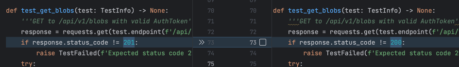

# Blob Api

## Description

This is a simple api to store and retrieve blobs.
In BlobApi folder there is the server, with all the endpoints, the blob_service, which is the service that manages the blobs, and the database, which is a simple json file.
The files are stored locally in the server, in the folder "storage", which can be changed with the params.

The cli folder contains a simple cli to interact with the api.
In the shell there is a CMD shell implementation. With all the commands useful for the api.
The blobservice and the blob files are the client Library to call the endpoints.

## Installation

Use [pip](https://pip.pypa.io/en/stable/) to install the requirements.

```bash
pip install -r requirements.txt 
```

There could be some problems with the installation of the package "adiauthcli", for example my pipeline in github actions fails because of that, so if you have problems with that, just install the package manually.

## Usage
The Shell can be used with interactive commands or can be used a Script file.
To use the interactive shell, just run the cli.py file, and the shell will start.
To use the script file use the option SCRIPT and the path of the script file.

All the endpoints are documented with swagger, and can be accessed in the url: http://127.0.0.1:3002 or other port if you change it.

# Entregable 2

## Description
In the second part of the project, I created the Dockerfile to create the image of the service

There are 4 scripts: build.sh, run.sh, stop.sh and run_tests.sh

## IMPORTANT

Please wait at least 10 minutes before running the gentraf tests, because the server is taking some time to set up.
I don't know if it is a problem with my computer, or with the code, but it is taking some time to start the server.

Once the server is running, the tests should pass.

Please delete also the folder "storage" before running the tests, because the tests are creating files in that folder, and delete also the blobs.json.
This is necessary fot the gentraf tests, because the gentraf tests are creating files in the storage folder, and the tests are failing if the folder and the file are not empty.

## build.sh

This script builds the image of the service.

## run.sh

This script runs the image of the service in a container.

### Parameters

The script has 2 parameters:
BLOB_SERVICE_PORT: The port where the service will be running.
BLOB_STORAGE_FOLDER: The path where the blobs will be stored.

To run it use the command:
    
```bash
./run.sh BLOB_SERVICE_PORT BLOB_STORAGE_FOLDER
```

Like:

```bash 
./run.sh  3003 custom/storage
```

Do not start the path with a slash, and do not end it with a slash.

## stop.sh

This script stops the container of the service.
It checks if the service is running, and if it is, it stops it.

## run_tests.sh

This script starts the mock server, and runs the run.sh
Remember that the port 3001 must be free, because the mock server will be running there.

To change the port use the .env file, changing AUTH_PORT variable.

## .env file

This file contains the variables that will be used in the scripts.
The variables are:

BLOB_SERVICE_PORT: The port where the service will be running.
BLOB_STORAGE_FOLDER: The path where the blobs will be stored.
AUTH_PORT: The port where the auth/mock server will be running.
AUTH_ADDRESS: The address where the auth server will be running. Right now it is set to host.docker.internal, because it will run inside the docker image.
MOCK_ADDRESS: The address where the mock server will be running.
DEFAULT_ENCODING: The default encoding of the files.
FILE_STORAGE: The path where the files will be stored.
BLOB_DB: The path where the Blob database will be stored.

## Gentraf

Right now all the test should pass, exept fot the get blobs.
I opened an issue where I described the problem.
The blobs endpoint should return a 200 and not a 201, because it is a get request.
To make all the tests pass, I changed the code of the gentraf project.

